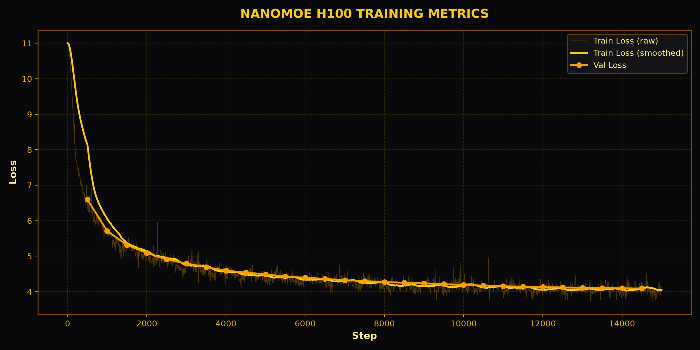

# nanoMoE (120M)

A modern 120M parameter **sparse Mixture-of-Experts (MoE)** Large Language Model built from scratch in PyTorch, featuring DeepSeek-style **Multi-head Latent Attention (MLA)**, **SwiGLU** gated activations, **RoPE** positional embeddings, and **Noisy Top-2 Expert Routing**. Pre-trained on **`HuggingFaceFW/fineweb-edu` (sample-10BT)** on NVIDIA H100 GPUs via Modal Cloud.

💻 **GitHub Repository**: [soumomo/nanoMoE](https://github.com/soumomo/nanoMoE)

---

## Model Architecture & Specifications

| Component / Spec | Implementation Details |
|---|---|
| **Total Parameters** | **120,579,584** (~120M) |
| **Active Parameters** | **~65,800,000** per token |
| **Architecture** | DeepSeek-MoE style Autoregressive Sparse Decoder |
| **Dataset** | [HuggingFaceFW/fineweb-edu](https://huggingface.co/datasets/HuggingFaceFW/fineweb-edu) (`sample-10BT`) |
| **Layers (`num_layers`)** | **8** |
| **Attention Mechanism** | Multi-head Latent Attention (MLA) |
| **Attention Heads (`num_heads`)** | **8** |
| **Embedding Dim (`d_model`)** | **512** |
| **Feed-Forward Dim (`d_ff`)** | **1,360** (8/3 * d_model SwiGLU ratio) |
| **Experts per Layer** | **4** |
| **Active Experts per Token (`top_k`)** | **2** |
| **Routing Mechanism** | Noisy Top-K Gating + Switch Transformer Load Balancing Loss |
| **Positional Embeddings** | Rotary Position Embeddings (RoPE) |
| **Normalization** | RMSNorm |
| **Context Length** | **512 tokens** |
| **Tokenizer** | tiktoken GPT-2 (50,257 vocabulary size) |

---

## Training Loss Curves



```text
=============================================================
                  NANOMOE TRAINING RESULTS                   
=============================================================
+------------------------------------+----------------------+
| Metric                             | Value                |
+------------------------------------+----------------------+
| Total Parameters                   | 120.58M              |
| Active Parameters (per token)      | 65.8M                |
| Total Training Steps               | 15,000 steps         |
| Total Tokens Trained               | ~491.5 Million       |
| Initial Loss                       | 10.9996              |
| Final Loss                         | 4.0612               |
| Final Validation Loss              | 4.1204               |
| Hardware                           | NVIDIA H100 (Modal)  |
| Precision                          | bfloat16 AMP         |
+------------------------------------+----------------------+
=============================================================
```

---

## Live Expert Routing Distribution (8 Layers)

```text
+----------+----------+----------+----------+----------+-------------+
| Layer    | Expert 0 | Expert 1 | Expert 2 | Expert 3 |  Top Expert |
+----------+----------+----------+----------+----------+-------------+
| Layer 1  |  48.1%   |  47.5%   |  48.1%   |  56.3%   |   Expert 3  |
| Layer 2  |  61.4%   |  49.4%   |  43.0%   |  46.2%   |   Expert 0  |
| Layer 3  |  53.2%   |  47.5%   |  45.6%   |  53.8%   |   Expert 3  |
| Layer 4  |  59.5%   |  51.9%   |  49.4%   |  39.2%   |   Expert 0  |
| Layer 5  |  43.0%   |  50.0%   |  61.4%   |  45.6%   |   Expert 2  |
| Layer 6  |  62.7%   |  32.3%   |  47.5%   |  57.6%   |   Expert 0  |
| Layer 7  |  58.9%   |  41.1%   |  41.1%   |  58.9%   |   Expert 0  |
| Layer 8  |  59.5%   |  55.1%   |  45.6%   |  39.9%   |   Expert 0  |
| -------- | -------- | -------- | -------- | -------- |   --------  |
| Overall  |  55.8%   |  46.8%   |  47.7%   |  49.7%   | Balanced ✅ |
+----------+----------+----------+----------+----------+-------------+
```

---

## Quick Usage

Clone the repository and run inference with `generate.py`:

```bash
git clone https://github.com/soumomo/nanoMoE.git
cd nanoMoE
uv sync
uv run python generate.py
```
